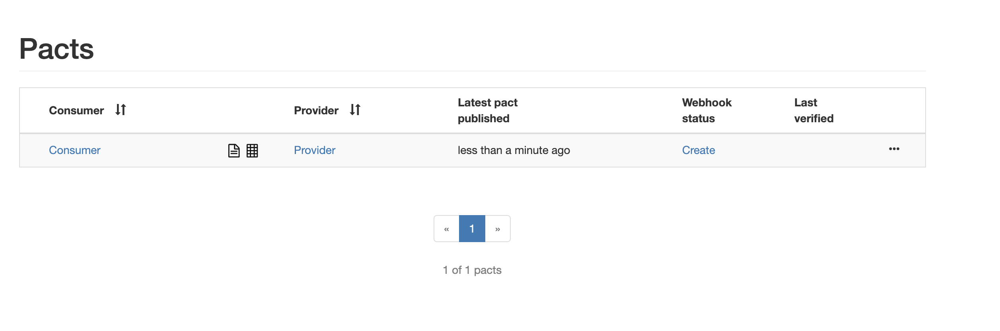
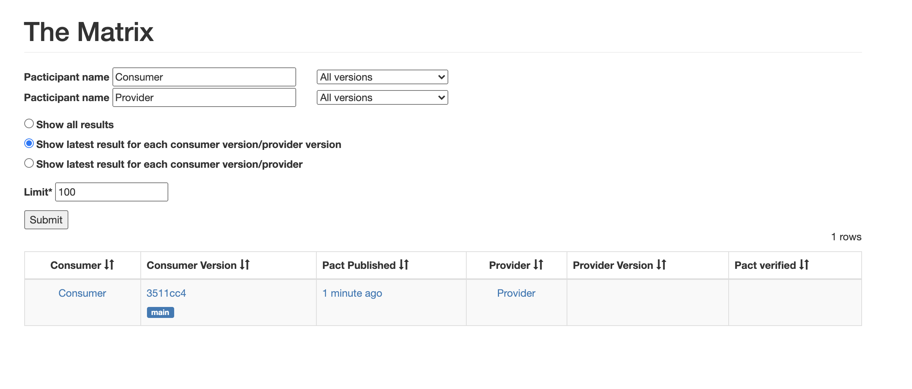

# Pact playground

## Pact broker

Before other commands become available you need to start a broker.

```bash
docker-compose up
```

## Running consumer tests

To run consumer tests and publish them to the local broker run
```bash
yarn consumer-pact
```




after than 
```bash
./wip_branches.sh
```

returns no pacts
```json
{"_embedded":{"pacts":[]},"_links":{"self":{"href":"http://localhost:9292/pacts/provider/Provider/for-verification","title":"Pacts to be verified"}}}%   
```

## Other commands

| Command | Description |
| ---- | --- |
| `yarn workspace consumer test` | Create consumer pact | 
| `yarn workspace consumer publish:pact` | Publish consumer pact | 
| `yarn workspace provider verify:pact` | Publish consumer pact | 
